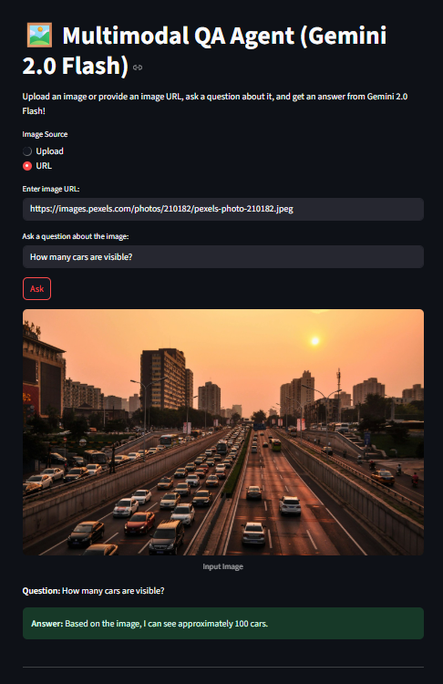
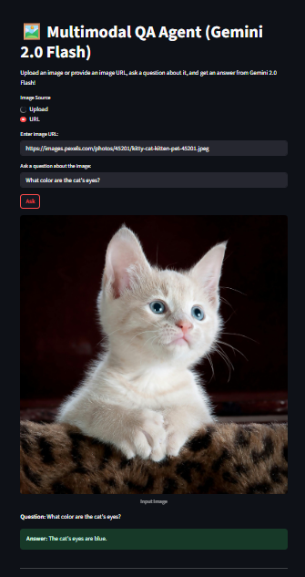
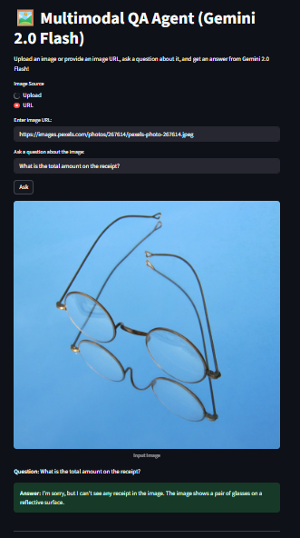

# Multimodal QA Agent

## Overview
This project is a simple multimodal Question Answering (QA) web app that allows users to:
- Upload an image (via file upload or URL)
- Ask a text question about the image
- Receive an answer using Google's Gemini 2.0 Flash Vision + Language LLM

**Bonus Features:**
- Fallback to a text-only LLM if image analysis fails
- Visualization of bounding boxes or key areas if supported by the API response

---

## Why Gemini 2.0 Flash?
Gemini 2.0 Flash is chosen for its:
- Fast and cost-effective inference
- Strong multimodal (image + text) reasoning capabilities
- Easy API integration

---

## Setup Instructions

1. **Clone the repository**
2. **Install dependencies**
   ```bash
   pip install -r requirements.txt
   ```
3. **Configure API keys**
   - Copy `example.env` to `.env` and fill in your Gemini API key.
4. **Run the app**
   ```bash
   streamlit run app.py
   ```

---

## Usage
- Open the web app in your browser.
- Upload an image or provide an image URL.
- Enter a question about the image.
- Click 'Ask'.
- View the answer and (if available) visualized bounding boxes.

---

## API Used
- **Gemini 2.0 Flash** (Vision + Language)
- (Optional fallback) Gemini 2.0 Flash (Text-only)

---

## Test Report / Sample Outputs

| Image | Question | Answer |
|-------|----------|--------|
|  | What color are the cat's eyes? | The cat's eyes are blue. |
|  | How many cars are visible? | Based on the image, I can see approximately 100 cars. |
|  | What is the total amount on the receipt? |  I'm sorry, but I can't see any receipt in the image. The image shows a pair of glasses on a reflective surface. |

---

### Visual Test Outputs

#### 1. How many cars are visible?


#### 2. What color are the cat's eyes?


#### 3. What is the total amount on the receipt?


---
